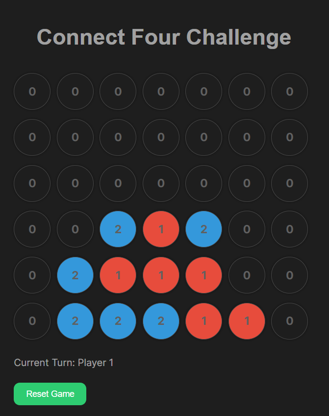
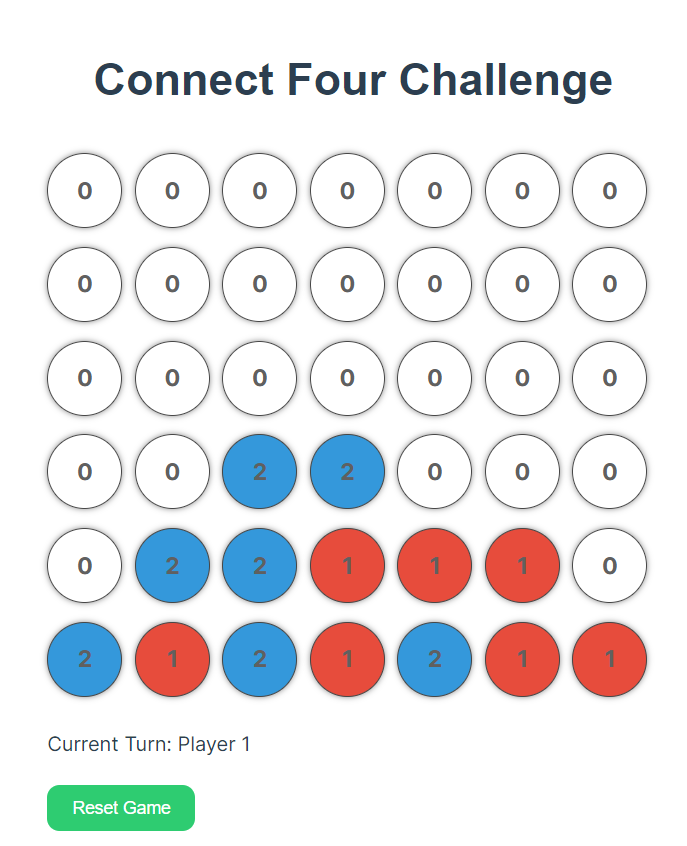

# ChipConnect4

Welcome to ChipConnect4 - a classic Connect 4 game with a twist!

## Introduction

ChipConnect4 is an interactive web-based implementation of the popular Connect 4 game. It offers a sleek and modern user interface, making it easy and enjoyable to play.

<p float="left">
  &nbsp;&nbsp;&nbsp;&nbsp;&nbsp;&nbsp;&nbsp;&nbsp;
  &nbsp;&nbsp;&nbsp;&nbsp;&nbsp;&nbsp;&nbsp;&nbsp;
  
</p>


## Features

- **Dark Mode:** Switch between light and dark modes for a personalized gaming experience.
- **Interactive Gameplay:** Click to drop your chip and strategize to connect four chips in a row.
- **Real-time Updates:** Instantly see the game board updates and check for a winner or a draw.
- **Confetti Effects:** Celebrate victories with delightful confetti animations using the `canvas-confetti` library.
- **Toast Notifications:** Receive in-game notifications and updates using the `vue-toast-notification` library.


## How to Play

Visit [ChipConnect4](https://chipconnect4.netlify.app/) and start playing right away! Follow these simple steps:

1. Open the game in your web browser.
2. Click on a column to drop your chip.
3. Connect four chips in a row horizontally, vertically, or diagonally to win.

## Technologies Used

- Vue.js
- HTML5
- CSS3
- canvas-confetti
- vue-toast-notification
-------------------------------------------------------------------
This template should help get you started developing with Vue 3 in Vite.

## Recommended IDE Setup

[VSCode](https://code.visualstudio.com/) + [Volar](https://marketplace.visualstudio.com/items?itemName=Vue.volar) (and disable Vetur) + [TypeScript Vue Plugin (Volar)](https://marketplace.visualstudio.com/items?itemName=Vue.vscode-typescript-vue-plugin).

## Customize configuration

See [Vite Configuration Reference](https://vitejs.dev/config/).

## Project Setup

```sh
npm install
```

### Compile and Hot-Reload for Development

```sh
npm run dev
```

### Compile and Minify for Production

```sh
npm run build
```
